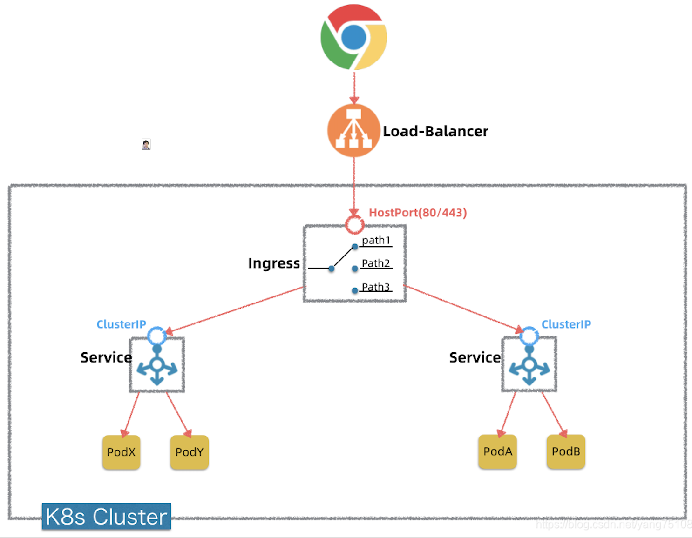

# 基于Kubernates发布一个go web应用

[English](README.md)  

## 架构图



## 发布所使用的配置文件的目录结构

```
Guobins-MBP:k8s-deployments guobin$ tree
.
├── app
│   ├── app-deployment.yml
│   └── app-service.yml
├── baremetal
│   ├── metallb.yml
│   └── values.yaml
├── dashboard
│   ├── admin-rbac.yml
│   ├── admin-user.yml
│   └── kubernetes-dashboard-deployment.yml
├── haproxy
│   ├── haproxy-ingress-values.yaml
│   └── ingress.yml
├── mysql
│   ├── mysql-deployment.yml
│   ├── mysql-pv.yml
│   ├── mysql-pvc.yml
│   ├── mysql-secret.yml
│   └── mysql-service.yml
└── net
    └── kube-flannel.yml

6 directories, 15 files
```

- app: go web服务的配置文件
- baremetal: 我实验用的，我们这里不会用到，这在本地机房部署k8s集群才会用
- haproxy: 我们这里只做简单的转发，方便将来扩展成其他的发布模式，包括
  - 灰度发布
  - 蓝绿发布
  - A/B Testing
  - ...
- mysql:我们的web服务依赖的数据库服务
- net: 集群网络配置
- dashboard: k8s监控

从配置文件的命名上可以看出kubernates的几种对象，这里只列举我们项目用到的：

- [deployment](https://kubernetes.io/docs/concepts/workloads/controllers/deployment/)
- [service](https://kubernetes.io/docs/concepts/services-networking/service/)
- [ingress](https://kubernetes.io/docs/concepts/services-networking/ingress/)
- [pv](https://kubernetes.io/docs/concepts/storage/persistent-volumes/)
- [pvc](https://kubernetes.io/docs/concepts/storage/persistent-volumes/)
- [secret](https://kubernetes.io/docs/concepts/configuration/secret/)
- ...

## 要用kubernates发布一个go web应用，主要经历3大过程

1. [搭建kubernates集群](install-cluster.md)有多种方式
   - 购买现成的各家云服务商已经整合好的集群服务
   - 在自己的电脑上搭建单机集群，推荐使用工具[minikube](https://minikube.sigs.k8s.io/docs/)+[virtualbox](https://www.virtualbox.org/)
   - 自己购买云服务器来搭建集群，推荐使用[kubeadmin](https://kubernetes.io/docs/setup/production-environment/tools/kubeadm/install-kubeadm/)工具（本案例使用该方式）
   - 在本地机房搭建集群，推荐使用[kubeadmin](https://kubernetes.io/docs/setup/production-environment/tools/kubeadm/install-kubeadm/)+[metallb](https://metallb.universe.tf/)
2. [把你本地的go web应用制成容器镜像](dockerize-go-app.md)
3. [把容器镜像跑在kubernates集群里](deploy-to-cluster.md)
4. [安装监控](dashboard.md)

## License

MIT
