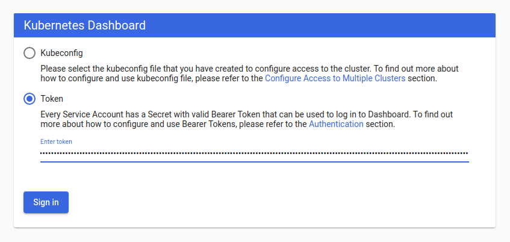

### [安装监控](https://github.com/kubernetes/dashboard)

```
cd ./k8s-deployments/dashboard
```

###### 准备工作

下载安装文件

```
wget https://raw.githubusercontent.com/kubernetes/dashboard/v2.3.1/aio/deploy/recommended.yaml
```
url中v2.3.1换成你对应的[版本](https://github.com/kubernetes/dashboard/releases)

重命名为`kubernetes-dashboard-deployment.yml`

```
mv recommended.yaml kubernetes-dashboard-deployment.yml
```

编辑`kubernetes-dashboard-deployment.yml`文件，修改Service部分的配置为对外暴露30002端口

```
kind: Service
apiVersion: v1
metadata:
  labels:
    k8s-app: kubernetes-dashboard
  name: kubernetes-dashboard
  namespace: kubernetes-dashboard
spec:
  ports:
    - port: 443
      targetPort: 8443
      nodePort: 30002
  selector:
    k8s-app: kubernetes-dashboard
  type: NodePort
```

###### 安装监控服务

```
kubectl apply -f kubernetes-dashboard-deployment.yml

#检查一下
kubectl get deployment -n kubernetes-dashboard
kubectl get pod -n kubernetes-dashboard
kubectl get service -n kubernetes-dashboard
```

访问Dashboard

打开浏览器访问http://172.19.96.118:30002，要求你提供一个用户token



###### 创建用户

创建一个admin用户，名字叫`admin-user`

```
kubectl apply -f admin-user.yml
```

创建一个角色绑定

```
kubectl apply -f admin-rbac.yml
```

获取该用户token

```
kubectl -n kubernetes-dashboard get secret $(kubectl -n kubernetes-dashboard get sa/admin-user -o jsonpath="{.secrets[0].name}") -o go-template="{{.data.token | base64decode}}"
```

填入token文本输入框后出现dashboard页面


