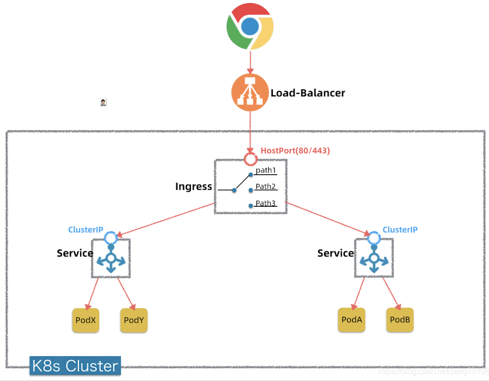
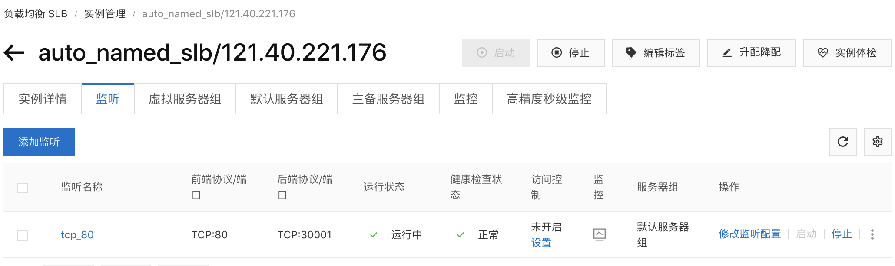
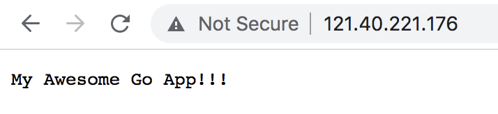
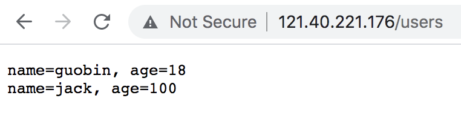

### 把容器镜像跑在kubernates集群里

###### 架构图



###### 发布所使用的配置文件的目录结构

```
Guobins-MBP:k8s-deployments guobin$ tree
.
├── app
│   ├── app-deployment.yml
│   └── app-service.yml
├── baremetal
│   ├── metallb.yml
│   └── values.yaml
├── haproxy
│   ├── haproxy-ingress-values.yaml
│   └── ingress.yml
├── mysql
│   ├── mysql-deployment.yml
│   ├── mysql-pv.yml
│   ├── mysql-pvc.yml
│   ├── mysql-secret.yml
│   ├── mysql-service.yml
│   └── mysql-service.yml.bak
└── net
    └── kube-flannel.yml

5 directories, 13 files
```

- app: go web服务的配置文件
- baremetal: 我实验用的，我们这里不会用到，这在本地机房部署k8s集群才会用
- haproxy: 我们这里只做个简单的转发，方便将来扩展
  - 灰度发布
  - 蓝绿发布
  - AB Testing
  - ...
- mysql:我们的web服务依赖的数据库服务
- net: 集群网络配置

kubernates有几种对象：deployment、service、ingress、pv、pvc、secret等等，对应到我们这里的配置文件

k8s对象：
- [deployment](https://kubernetes.io/docs/concepts/workloads/controllers/deployment/)：创建一组[pod](https://kubernetes.io/docs/concepts/workloads/pods/#what-is-a-pod)
- [service](https://kubernetes.io/docs/concepts/services-networking/service/)：暴露一组pod供外部访问
- [ingress](https://kubernetes.io/docs/concepts/services-networking/ingress/)：暴露一组service供外部访问
- [pv](https://kubernetes.io/docs/concepts/storage/persistent-volumes/)：数据持久化卷（声明）
- [pvc](https://kubernetes.io/docs/concepts/storage/persistent-volumes/)：数据持久化卷（使用）
- [secret](https://kubernetes.io/docs/concepts/configuration/secret/)：类似环境变量

以下所有的发布都到默认的namespace：`default`，namespace可以用来区分发布环境，如`namespace=staging, namespace=dev`等

#### 部署go web服务

###### 创建一个deployment

从qiuguobin的dockerhub上拉取镜像部署到集群

```
[guobin@k8s-master ~]$ kubectl apply -f app-deployment.yml

[guobin@k8s-master ~]$ kubectl get deployments
NAME                                      READY   UP-TO-DATE   AVAILABLE   AGE
go-web-app-deployment                     2/2     2            2           4d2h

[guobin@k8s-master ~]$ kubectl get pods --all-namespaces
NAMESPACE     NAME                                                       READY   STATUS    RESTARTS   AGE
default       go-web-app-deployment-6fd8d76dff-gdmbn                     1/1     Running   0          4d2h
default       go-web-app-deployment-6fd8d76dff-ww6g5                     1/1     Running   0          4d2h
...
```

###### 创建一个service

暴露deployment创建的pods供集群外部访问，暴露端口为：30000（NodePort方式）

[service type](https://kubernetes.io/docs/concepts/services-networking/service/#publishing-services-service-types)
- ClusterIP：internet不能访问，只能进到安装k8s的宿主机里去访问
- NodePort：internet能访问，通过<NodeIP>:<NodePort>访问，本案例使用的此种方式
- LoadBalancer: internet能访问的前提是启用云服务商提供的负载均衡服务
- ExtenalName：没用过

```
[guobin@k8s-master ~]$ kubectl apply -f app-service.yml

[guobin@k8s-master ~]$ kubectl get services
NAME                                      TYPE        CLUSTER-IP    EXTERNAL-IP   PORT(S)                      AGE
go-web-service                            NodePort    10.1.12.74    <none>        8080:30000/TCP               4d
...
```

#### 部署mysql服务

###### 创建一个本地磁盘存储

```
[guobin@k8s-master ~]$ kubectl apply -f mysql-pv.yml
[guobin@k8s-master ~]$ kubectl apply -f mysql-pvc.yml

[guobin@k8s-master ~]$ kubectl get pv
NAME              CAPACITY   ACCESS MODES   RECLAIM POLICY   STATUS   CLAIM                    STORAGECLASS   REASON   AGE
mysql-pv-volume   1Gi        RWO            Retain           Bound    default/mysql-pv-claim   manual                  4d23h

[guobin@k8s-master ~]$ kubectl get pvc
NAME             STATUS   VOLUME            CAPACITY   ACCESS MODES   STORAGECLASS   AGE
mysql-pv-claim   Bound    mysql-pv-volume   1Gi        RWO            manual         4d23h
```

为什么有了pv，还要pvc？

```
pod <--> pv          bad
pod <--> pvc <--> pv good
```
从设计模式上来说，pod不直接绑定pv，而是通过绑定pvc，再由pvc去绑定pv，其实是起到了pod和pv之间解耦的作用，
类似于两张多对多的表会通过加中间表去做关联一样的道理

###### 创建一个环境变量文件

```
[guobin@k8s-master ~]$ kubectl apply -f mysql-secret.yml

[guobin@k8s-master ~]$ kubectl get secret
NAME                                  TYPE                                  DATA   AGE
mysql-secret                          Opaque                                4      5d22h
```

###### 创建一个deployment

```
[guobin@k8s-master ~]$ kubectl apply -f mysql-deployment.yml

[guobin@k8s-master ~]$ kubectl get deployments
NAME                                      READY   UP-TO-DATE   AVAILABLE   AGE
go-web-app-deployment                     2/2     2            2           4d2h
mysql                                     1/1     1            1           4d23h
...

[guobin@k8s-master ~]$ kubectl get pods --all-namespaces
NAMESPACE     NAME                                                       READY   STATUS    RESTARTS   AGE
default       go-web-app-deployment-6fd8d76dff-gdmbn                     1/1     Running   0          4d2h
default       go-web-app-deployment-6fd8d76dff-ww6g5                     1/1     Running   0          4d2h
default       mysql-6db984b79d-jq7qq                                     1/1     Running   0          4d23h
...
```

###### 创建一个service

不允许外部访问，只能集群内部之间访问（ClusterIP方式）

```
[guobin@k8s-master ~]$ kubectl apply -f mysql-service.yml

[guobin@k8s-master ~]$ kubectl get services
NAME                                      TYPE        CLUSTER-IP    EXTERNAL-IP   PORT(S)                      AGE
...
mysql                                     ClusterIP   None          <none>        3306/TCP                     4d2h
...
```

###### 彻底删除

除了删除持久化卷

```
kubectl delete pvc mysql-pv-claim
kubectl delete pv mysql-pv-volume
```

还要进到你的服务器里去删除其挂载目录

```
rm -rf /mnt/data
```

#### 部署haproxy ingress服务

haproxy的配置文件有两种创建方式：deployment和[helm](https://helm.sh/docs/intro/install/)，我们这里采用helm方式来创建，这比自己写deployment省心很多哦

通过下面的脚本安装应该是最方便的

```
$ curl -fsSL -o get_helm.sh https://raw.githubusercontent.com/helm/helm/master/scripts/get-helm-3
$ chmod 700 get_helm.sh
$ ./get_helm.sh
```

我在阿里云服务器上下载不下来，所以是通过手动下载到本地，再上传到服务器上去编译安装的 
>https://helm.sh/docs/intro/install/#from-the-binary-releases

####### 更新helm源

```
helm repo add stable https://charts.helm.sh/stable
helm repo add incubator https://charts.helm.sh/incubator
```

stable库里是已经稳定的，incubator库里是正在孵化的

```
helm repo list

NAME     	URL
stable   	https://charts.helm.sh/stable
incubator	https://charts.helm.sh/incubator
```

###### helm安装haproxy ingress

> https://github.com/haproxy-ingress/charts

```
helm install haproxy incubator/haproxy-ingress --create-namespace --namespace default -f haproxy-ingress-values.yaml
```
haproxy-ingress-values.yaml这个文件告诉helm，你希望它怎么安装你的haproxy ingress服务。
这里我们让haproxy暴露一个30001端口供外部internet访问

```
[guobin@k8s-master ~]$ helm list
NAME    NAMESPACE       REVISION        UPDATED                                 STATUS          CHART                   APP VERSION
haproxy default         1               2021-07-19 16:59:14.961230318 +0800 CST deployed        haproxy-ingress-0.0.28  0.7.2      

[guobin@k8s-master ~]$ kubectl get deployments
NAME                                      READY   UP-TO-DATE   AVAILABLE   AGE
...
haproxy-haproxy-ingress-controller        2/2     2            2           24h
haproxy-haproxy-ingress-default-backend   1/1     1            1           24h
...
```

###### 创建一个转发规则

这里直接转发所有外部流量到后端服务，未做任何分流处理

```
[guobin@k8s-master ~]$ kubectl apply -f ingress.yml

[guobin@k8s-master ~]$ kubectl get ingress
NAME                     CLASS    HOSTS   ADDRESS   PORTS   AGE
go-web-service-ingress   <none>   *                 80      24h

[guobin@k8s-master ~]$ kubectl get pods --all-namespaces
NAMESPACE     NAME                                                       READY   STATUS    RESTARTS   AGE
...
default       haproxy-haproxy-ingress-controller-697c5bc66c-cnk6d        1/1     Running   0          24h
default       haproxy-haproxy-ingress-controller-697c5bc66c-wlp4j        1/1     Running   0          24h
default       haproxy-haproxy-ingress-default-backend-5b74fff5f7-gtxrs   1/1     Running   0          24h
...
```

#### 优化

生产环境我们访问网站都会使用80和433端口，这样可以省略口端号，而k8s的NodePort给我们暴露
的端口规定要从30000开始，为了隐藏NodePort暴露的端口，我申请了一个负载均衡SLB服务，IP为`121.40.221.176`，
这样所有对80端口的访问都可以被映射到30001端口。



访问主页http://121.40.221.176/



访问用户列表页http://121.40.221.176/users


